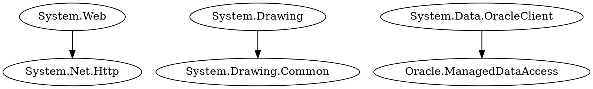

# 🧭 .NET CLI Migration Tool

Welcome to the **.NET CLI Migration Tool**, a cutting-edge solution designed to streamline the migration of **.NET Framework** projects to **.NET 9.0**.  
Built with advanced code analysis, automated refactoring, and an optional **LLM-based migration mode**, this tool helps developers identify deprecated libraries, suggest modern replacements, and simplify the migration process.

> 🕒 *Last updated at 11:23 AM IST on Tuesday, October 14, 2025.*

---

## ✨ Features

### 🧩 Deprecated Library Detection
- Uses **Roslyn semantic analysis** to identify outdated namespaces such as:
  - `System.Web`
  - `System.Drawing`
  - `System.Data.OracleClient`
  - `System.Transactions`

### ⚙️ Code Migration Assistance
- Automatically rewrites or annotates code with migration suggestions.
- Example:
  ```csharp
  // Before
  var context = HttpContext.Current;

  // After
  var context = httpContextAccessor.HttpContext;
  ```
- Adds `// TODO:` comments where manual review is needed.

---

### 🖥 Interactive UI
A **React-based frontend** featuring:

- 🌳 **Tree view** (via React-Arborist) for project structure visualization.
- 🧩 **Monaco Editor** for code comparison and editing.
- 🧾 **Summary panel** for displaying migration results.
- 🧭 **Sidebar** for project navigation and status indicators.

---

### 📂 File Upload Support
Supports both:
- Individual `.csproj` uploads.
- Compressed `.zip` archives for batch project analysis.

---

### 🔀 Migration Options

#### 🧠 Roslyn-Based Migration
Uses **Microsoft.CodeAnalysis (Roslyn)** to refactor and modernize your project automatically.

#### 🤖 LLM-Based Migration (Grok via xAI API)
Offers **AI-driven migration suggestions** for scenarios where Roslyn output requires refinement.

---

### 🌐 Semantic Graph Visualization
Integrates with **Neo4j Aura** to generate and display dependency graphs between namespaces, classes, and files *(optional feature)*.

---

### 💾 Download Functionality
Export migrated projects as `.zip` archives for easy download and reuse.

---

### 🌙 Customizable Themes
Switch between **Light** and **Dark** modes for a personalized developer experience.

---

### 🚨 Error Handling
- Continues analysis even if Neo4j is offline.
- Displays clear, developer-friendly error messages without interrupting execution.

---

## 🎯 Project Goals
- 🚀 Accelerate migration of legacy .NET Framework projects to **.NET 9.0**.
- 🔍 Identify deprecated APIs and suggest modern replacements automatically.
- 🤖 Combine **Roslyn precision** with **LLM flexibility** for robust migration options.
- 💡 Provide a clean, intuitive, and visual migration interface for all developers.

---

## 🛠 Tech Stack

| Component | Technology |
|------------|-------------|
| **Backend** | Node.js, Express, Multer, Axios, CORS |
| **Analyzer** | C# (.NET 9.0) with Microsoft.CodeAnalysis (Roslyn) |
| **Database** | Neo4j Aura *(optional)* |
| **Frontend** | React, Ant Design, React-Arborist, Monaco Editor |
| **AI Migration** | xAI Grok API Integration |
| **Styling** | Custom CSS with theme toggling |
| **Dev Tools** | npm, Git, Visual Studio, VS Code |

---

## 🚀 Getting Started

### 🧾 Prerequisites
Make sure you have the following installed:
- **Node.js** (v14 or later)
- **.NET SDK** (v9.0)
- **Neo4j Aura account** *(optional for graph features)*
- **xAI API key** *(required for LLM migration)*

---

### ⚙️ Installation

#### 1️⃣ Clone the Repository
```bash
git clone https://github.com/your-username/dotnet-migration-tool.git
cd dotnet-migration-tool
```

#### 2️⃣ Install Backend Dependencies
```bash
cd backend
npm install
```

#### 3️⃣ Install Frontend Dependencies
```bash
cd ../frontend
npm install
```

#### 4️⃣ Build the Frontend
```bash
cd frontend
npm run build
```
- Copy the `build` folder to the `backend` directory  
  **or** update the `frontendBuildPath` in `backend/index.js`.

---

#### 5️⃣ Configure Environment
Create a `.env` file in the **frontend** directory:
```bash
REACT_APP_XAI_API_KEY=your-xai-api-key
```
Ensure the backend serves the built frontend (verify in `backend/index.js`).

---

### ▶️ Run the Application
```bash
cd ../backend
node index.js
```
Then open your browser and visit:  
👉 **http://localhost:3001**

---

## 🧭 Example Workflow
1. Upload your `.csproj` or `.zip` file.
2. Choose migration type — **Roslyn** or **LLM**.
3. Review detected deprecated APIs.
4. Confirm migration or view AI suggestions.
5. Download migrated project as a `.zip`.

---

## 🧱 Project Structure
```
.NET-CLI-Migration-Tool/
│
├── backend/
│   ├── index.js
│   ├── routes/
│   ├── services/
│   ├── analyzer.exe
│   └── package.json
│
├── frontend/
│   ├── src/
│   ├── public/
│   ├── package.json
│   └── .env
│
├── neo4j/
│   └── config.json
│
├── README.md
└── LICENSE
```

---

## 📊 Network Visualization Example
You can visualize dependency relationships using **Graphviz** or **Neo4j Browser**.

### Example (DOT format output)


---

## 🧠 Future Improvements
- 🧩 Add full **LLM-based auto-refactoring pipeline** with memory caching.  
- 🧰 Integrate **VS Code extension** for real-time migration.  
- 🔄 Add **GitHub Action** for continuous migration tracking.  
- 🪟 Support **cross-platform CLI tool** for macOS/Linux.  
- 🔤 Implement **multi-language migration (VB.NET → C#)**.  
- 📈 Add **detailed migration reports** with success metrics.

---

## 📝 Progress

**Current Status:**
- ✅ Roslyn-based migration with confirmation modal  
- ✅ Project structure visualization  
- ✅ Download functionality  
- ✅ Semantic graph display  
- ✅ Theme switching and error handling  

**In Progress:**
- 🔄 LLM (xAI Grok) integration with backend and frontend buttons  
- 🔄 Testing and optimizing LLM migration responses  

---

## 🤝 Contributing
We welcome contributions from the community! 🎉

1. Fork the repository  
2. Create a new feature branch  
3. Commit and push your changes  
4. Submit a Pull Request  

Please ensure:
- 🧹 Code is formatted and tested  
- 🧾 Documentation is updated  

---

## 📄 License
This project is licensed under the **MIT License**.  
See the [LICENSE](LICENSE) file for more details.